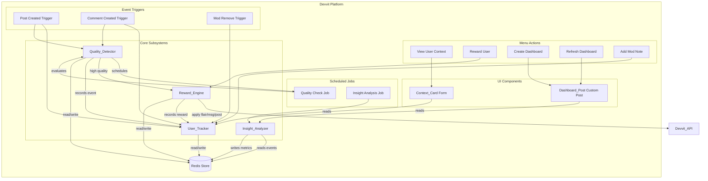

# Design Document: ModGuardian

## Overview

ModGuardian is a Devvit moderation app that shifts the moderation paradigm from purely punitive to a balanced approach combining positive reinforcement with user context tracking. The app runs entirely within the Devvit platform, using Redis for persistence, triggers for event-driven processing, scheduled jobs for analytics, menu actions for moderator interactions, and custom posts for dashboards.

The system is composed of six subsystems:

1. **Quality_Detector** — Evaluates posts/comments against configurable thresholds using Devvit triggers on post/comment creation events. Uses a delayed evaluation pattern: schedules a check after content receives initial votes.
2. **Reward_Engine** — Applies flair, private messages, and recognition posts to high-quality contributors. Invoked automatically by Quality_Detector or manually via menu actions.
3. **User_Tracker** — Records all contribution events and mod actions to Redis. Maintains a running Quality_Score per user.
4. **Context_Card** — A Devvit form/modal displayed via menu action showing a user's full history, quality score, and action buttons.
5. **Insight_Analyzer** — A scheduled Devvit job that computes community-level metrics (totals, averages, top contributors, at-risk users).
6. **Dashboard_Post** — A custom Devvit post type rendering community health metrics and top contributor lists.

### Key Design Decisions

- **Delayed evaluation via scheduler**: Rather than evaluating quality at post creation (when vote counts are zero), the Quality_Detector schedules a job to check the content after a delay, allowing votes to accumulate. This uses `scheduler.runJob()` with a configurable delay.
- **Idempotent rewards**: The Reward_Engine tracks applied rewards per (user, contribution, reward_type) tuple in Redis to prevent duplicates.
- **Redis sorted sets for timelines**: User events are stored in Redis sorted sets keyed by timestamp, enabling efficient reverse-chronological retrieval for the Context_Card.
- **Schema versioning**: All serialized objects include a `schemaVersion` field to support future data migrations without breaking existing data.
- **Namespaced Redis keys**: All keys follow a `modguardian:{datatype}:{identifier}` pattern to prevent collisions.

## Architecture



### Data Flow

1. **Post/Comment Creation**: Trigger fires → User_Tracker records event → Quality_Detector schedules delayed evaluation job
2. **Quality Evaluation**: Scheduled job fires → Quality_Detector fetches current vote data → If thresholds met, records high-quality event → Triggers Reward_Engine
3. **Reward Application**: Reward_Engine checks idempotency → Applies enabled rewards (flair, message, recognition post) → Records reward event via User_Tracker
4. **Context Card**: Moderator clicks menu action → App fetches user data from Redis → Renders Context_Card form with history, score, and action buttons
5. **Insights**: Scheduled job fires at configured interval → Insight_Analyzer aggregates events from Redis → Stores computed metrics
6. **Dashboard**: Moderator creates/refreshes dashboard → Custom post renders latest metrics from Redis

## Components and Interfaces

### Quality_Detector

```typescript
// Triggered by post/comment creation events
// Schedules a delayed quality check job

interface QualityCheckJobData {
  contentId: string;       // t3_ or t1_ prefixed Reddit ID
  contentType: 'post' | 'comment';
  authorUsername: string;
  subredditId: string;
  createdAt: number;       // epoch ms
}

interface QualityThresholds {
  minUpvoteRatio: number;  // 0.0–1.0, default 0.85
  minPostScore: number;    // 1–10000, default 50
  minCommentScore: number; // 1–10000, default 25
}

// Functions
function onPostCreate(event: PostCreate): Promise<void>;
function onCommentCreate(event: CommentCreate): Promise<void>;
function evaluateQuality(jobData: QualityCheckJobData, thresholds: QualityThresholds): Promise<boolean>;
```

### Reward_Engine

```typescript
interface RewardConfig {
  flairEnabled: boolean;
  flairText: string;           // default "Quality Contributor"
  flairCssClass: string;
  thankYouEnabled: boolean;
  thankYouTemplate: string;    // supports {{username}}, {{link}} placeholders
  recognitionPostEnabled: boolean;
  recognitionPostTitleTemplate: string;
}

type RewardType = 'flair' | 'thank_you_message' | 'recognition_post';

// Functions
function applyRewards(username: string, contentId: string, contentType: 'post' | 'comment'): Promise<void>;
function applyManualReward(username: string, contentId: string, moderator: string): Promise<void>;
function hasRewardBeenApplied(username: string, contentId: string, rewardType: RewardType): Promise<boolean>;
```

### User_Tracker

```typescript
interface ContributionEvent {
  schemaVersion: number;       // current: 1
  eventId: string;             // unique ID
  eventType: 'post_created' | 'comment_created' | 'post_quality' | 'comment_quality' | 'reward_granted';
  username: string;
  contentId: string;
  timestamp: number;           // epoch ms
  metadata: Record<string, string>;  // flexible extra data
}

interface ModAction {
  schemaVersion: number;       // current: 1
  actionId: string;            // unique ID
  actionType: 'removal' | 'warning' | 'ban' | 'note' | 'reward';
  targetUsername: string;
  moderatorUsername: string;
  contentId: string;
  timestamp: number;           // epoch ms
  reason: string;
  metadata: Record<string, string>;
}

interface ModNote {
  noteId: string;
  targetUsername: string;
  moderatorUsername: string;
  text: string;
  timestamp: number;           // epoch ms
}

interface QualityScore {
  username: string;
  score: number;               // 0–100
  lastUpdated: number;         // epoch ms
}

// Functions
function recordContributionEvent(event: ContributionEvent): Promise<void>;
function recordModAction(action: ModAction): Promise<void>;
function addModNote(note: ModNote): Promise<void>;
function getUserEvents(username: string, limit?: number): Promise<ContributionEvent[]>;
function getUserModActions(username: string, limit?: number): Promise<ModAction[]>;
function getUserModNotes(username: string): Promise<ModNote[]>;
function getQualityScore(username: string): Promise<QualityScore>;
function recalculateQualityScore(username: string): Promise<number>;
```

### Context_Card

```typescript
interface ContextCardData {
  username: string;
  qualityScore: QualityScore;
  qualityLabel: 'Poor' | 'Fair' | 'Good' | 'Excellent';
  stats: {
    totalPosts: number;
    totalComments: number;
    totalRemovals: number;
    totalWarnings: number;
    totalRewards: number;
  };
  recentActivity: (ContributionEvent | ModAction)[];  // last 10, reverse chronological
  modNotes: ModNote[];                                  // all, reverse chronological
}

// Functions
function getQualityLabel(score: number): 'Poor' | 'Fair' | 'Good' | 'Excellent';
function buildContextCardData(username: string): Promise<ContextCardData>;
function renderContextCard(data: ContextCardData): Devvit.BlockComponent;
```

### Quality Label Mapping

| Score Range | Label     |
|-------------|-----------|
| 0–24        | Poor      |
| 25–49       | Fair      |
| 50–74       | Good      |
| 75–100      | Excellent |

### Insight_Analyzer

```typescript
interface CommunityMetrics {
  schemaVersion: number;
  timestamp: number;           // epoch ms when computed
  periodStart: number;         // epoch ms
  periodEnd: number;           // epoch ms
  totalPosts: number;
  totalComments: number;
  totalRemovals: number;
  totalRewards: number;
  averageQualityScore: number;
  newHighQualityContributors: number;
  topContributors: { username: string; score: number }[];  // top 10
  atRiskUsers: { username: string; scoreDrop: number }[];
}

// Functions
function runAnalysis(periodStart: number, periodEnd: number): Promise<CommunityMetrics>;
function getLatestMetrics(): Promise<CommunityMetrics | null>;
function getMetricsHistory(startDate: number, endDate: number): Promise<CommunityMetrics[]>;
```

### Dashboard_Post

```typescript
// Custom Devvit post type
// Renders community metrics and top contributors

function DashboardPost(): Devvit.BlockComponent;
function createDashboardPost(subredditName: string): Promise<void>;
function refreshDashboardPost(postId: string): Promise<void>;
```

### App Settings Schema

```typescript
// Devvit.addSettings configuration
const appSettings = {
  // Quality thresholds
  minUpvoteRatio: { type: 'number', label: 'Min Upvote Ratio', default: 0.85 },
  minPostScore: { type: 'number', label: 'Min Post Score', default: 50 },
  minCommentScore: { type: 'number', label: 'Min Comment Score', default: 25 },

  // Reward toggles
  flairEnabled: { type: 'boolean', label: 'Enable Flair Reward', default: true },
  thankYouEnabled: { type: 'boolean', label: 'Enable Thank-You Message', default: true },
  recognitionPostEnabled: { type: 'boolean', label: 'Enable Recognition Posts', default: false },

  // Reward text
  flairText: { type: 'string', label: 'Flair Text', default: 'Quality Contributor' },
  thankYouTemplate: { type: 'string', label: 'Thank-You Message Template', default: 'Thanks for your quality contribution, {{username}}! Your post/comment has been recognized: {{link}}' },
  recognitionPostTitle: { type: 'string', label: 'Recognition Post Title', default: 'Shoutout to {{username}} for a quality contribution!' },

  // Scheduling
  analysisIntervalHours: { type: 'number', label: 'Analysis Interval (hours)', default: 24 },
};
```

## Data Models

### Redis Key Schema

All keys follow the pattern `modguardian:{namespace}:{identifier}`.

| Key Pattern | Type | Description |
|---|---|---|
| `modguardian:events:{username}` | Sorted Set | User's contribution events, scored by timestamp |
| `modguardian:actions:{username}` | Sorted Set | Mod actions on user, scored by timestamp |
| `modguardian:notes:{username}` | Sorted Set | Mod notes for user, scored by timestamp |
| `modguardian:score:{username}` | String (JSON) | User's current QualityScore object |
| `modguardian:rewards:{username}:{contentId}:{rewardType}` | String | Idempotency key for reward deduplication |
| `modguardian:metrics:{timestamp}` | String (JSON) | Community metrics snapshot |
| `modguardian:metrics:latest` | String (JSON) | Most recent community metrics |
| `modguardian:event:{eventId}` | String (JSON) | Individual event detail |
| `modguardian:action:{actionId}` | String (JSON) | Individual mod action detail |
| `modguardian:note:{noteId}` | String (JSON) | Individual mod note detail |
| `modguardian:users:active` | Set | Set of all tracked usernames |
| `modguardian:quality:check:{contentId}` | String | Flag to prevent duplicate quality checks |

### Serialization Format

All objects are serialized to JSON with the following conventions:
- Timestamps are stored as epoch milliseconds (number)
- All objects include a `schemaVersion` field (number)
- String fields use UTF-8 encoding
- Empty optional fields are omitted (not stored as null)

### Quality Score Calculation

```
Quality_Score = clamp(0, 100, BASE_SCORE + positive_points - negative_points)

Where:
  BASE_SCORE = 50
  positive_points = (post_count * 2) + (comment_count * 1) + (quality_post_count * 5) + (quality_comment_count * 3) + (reward_count * 4)
  negative_points = (removal_count * 10) + (warning_count * 15)
```

The score is clamped to the range [0, 100]. Each event type contributes a fixed number of points. This formula is intentionally simple and transparent so moderators can understand why a user has a given score.

### Data Retention

- User events and actions: retained for 365 days from the most recent event for that user
- Community metrics: retained indefinitely (small per-snapshot footprint)
- Mod notes: retained indefinitely until manually deleted
- Idempotency keys (rewards): retained for 30 days


## Correctness Properties

*A property is a characteristic or behavior that should hold true across all valid executions of a system — essentially, a formal statement about what the system should do. Properties serve as the bridge between human-readable specifications and machine-verifiable correctness guarantees.*

### Property 1: Content creation schedules quality check

*For any* post or comment creation event in the subreddit, the Quality_Detector shall schedule a delayed quality check job containing the correct content ID, content type, author username, and creation timestamp.

**Validates: Requirements 1.1, 1.2**

### Property 2: Quality classification correctness

*For any* post with a given (score, upvoteRatio) and configured thresholds (minPostScore, minUpvoteRatio), the Quality_Detector shall classify the post as high-quality if and only if score >= minPostScore AND upvoteRatio >= minUpvoteRatio. *For any* comment with a given score and configured threshold (minCommentScore), the Quality_Detector shall classify the comment as high-quality if and only if score >= minCommentScore.

**Validates: Requirements 1.3, 1.4**

### Property 3: High-quality classification records event

*For any* contribution classified as high-quality by the Quality_Detector, a corresponding Contribution_Event with eventType 'post_quality' or 'comment_quality' shall be recorded in the store, and the event's username and contentId shall match the original contribution.

**Validates: Requirements 1.5**

### Property 4: Reward application matches configuration

*For any* reward configuration (with each reward type independently enabled or disabled) and any high-quality contribution, the Reward_Engine shall apply exactly the set of enabled reward types and no disabled reward types. Specifically: flair is applied iff flairEnabled is true, thank-you message is sent iff thankYouEnabled is true, and recognition post is created iff recognitionPostEnabled is true.

**Validates: Requirements 2.1, 2.2, 2.3, 2.4**

### Property 5: Reward idempotency

*For any* (username, contentId, rewardType) tuple, calling applyRewards multiple times shall result in the reward being executed exactly once. Subsequent calls for the same tuple shall be no-ops.

**Validates: Requirements 2.5**

### Property 6: Event recording preserves all required fields

*For any* Contribution_Event or Mod_Action recorded via the User_Tracker, retrieving the event shall yield an object whose username (or targetUsername), contentId, timestamp, and type fields are identical to the values provided at recording time.

**Validates: Requirements 3.1, 3.2, 3.3, 3.4**

### Property 7: Quality score calculation

*For any* user with a known set of Contribution_Events and Mod_Actions, the computed Quality_Score shall equal clamp(0, 100, 50 + (posts * 2) + (comments * 1) + (qualityPosts * 5) + (qualityComments * 3) + (rewards * 4) - (removals * 10) - (warnings * 15)), where each count is derived from the user's event history.

**Validates: Requirements 3.5**

### Property 8: Quality label mapping

*For any* integer score in the range [0, 100], getQualityLabel shall return 'Poor' for scores 0–24, 'Fair' for 25–49, 'Good' for 50–74, and 'Excellent' for 75–100.

**Validates: Requirements 4.2**

### Property 9: Event stats aggregation

*For any* set of Contribution_Events and Mod_Actions for a user, the Context_Card stats (totalPosts, totalComments, totalRemovals, totalWarnings, totalRewards) shall each equal the count of events matching the corresponding event type in the user's history.

**Validates: Requirements 4.3**

### Property 10: Reverse chronological ordering

*For any* set of timestamped events (Contribution_Events, Mod_Actions, or Mod_Notes) retrieved for a user, the returned list shall be sorted in strictly non-increasing order of timestamp, and limited to the configured maximum (10 for recent activity, unlimited for mod notes).

**Validates: Requirements 4.4, 4.5**

### Property 11: Community metrics computation

*For any* set of events within a given time period, the Insight_Analyzer shall compute totalPosts, totalComments, totalRemovals, and totalRewards equal to the actual counts of each event type in that period. The averageQualityScore shall equal the mean of all active users' scores. The topContributors list shall contain the 10 users with the highest Quality_Scores in descending order.

**Validates: Requirements 5.2, 5.3**

### Property 12: At-risk user identification

*For any* user whose Quality_Score at the start of the analysis period minus their Quality_Score at the end exceeds 20 points, the Insight_Analyzer shall include that user in the atRiskUsers list. Users whose score drop is 20 or less shall not be included.

**Validates: Requirements 5.4**

### Property 13: Dashboard renders all required data

*For any* CommunityMetrics object, the Dashboard_Post rendering shall include the values for totalPosts, totalComments, totalRemovals, totalRewards, averageQualityScore, and each top contributor's username and score.

**Validates: Requirements 6.2, 6.3**

### Property 14: Settings validation

*For any* numeric value submitted for a settings field, the validator shall accept the value if and only if it falls within the defined range (upvote ratio: 0.0–1.0, post score: 1–10000, comment score: 1–10000, analysis interval: 1–168). Values outside the range shall be rejected with a descriptive error message.

**Validates: Requirements 7.5**

### Property 15: Key namespace separation

*For any* two distinct data types (events, actions, notes, scores, metrics, rewards) and any identifier, the Redis key generated for each shall have a different namespace prefix, ensuring no key collisions between data types.

**Validates: Requirements 8.6**

### Property 16: ContributionEvent serialization round-trip

*For any* valid ContributionEvent object, serializing it to JSON and then deserializing the JSON back shall produce an object equivalent to the original, with all fields (including schemaVersion, eventId, eventType, username, contentId, timestamp, and metadata) preserved.

**Validates: Requirements 9.1, 9.2, 9.5, 8.4**

### Property 17: ModAction serialization round-trip

*For any* valid ModAction object, serializing it to JSON and then deserializing the JSON back shall produce an object equivalent to the original, with all fields (including schemaVersion, actionId, actionType, targetUsername, moderatorUsername, contentId, timestamp, reason, and metadata) preserved.

**Validates: Requirements 9.3, 9.4, 9.6, 8.4**

## Error Handling

### Retry Strategies

| Subsystem | Failure Type | Strategy | Max Retries | Backoff |
|---|---|---|---|---|
| Quality_Detector | Reddit API error during evaluation | Exponential backoff retry | 3 | 1s, 2s, 4s |
| Reward_Engine | Insufficient permissions | Notify moderator, log failure | 0 (no retry) | N/A |
| Reward_Engine | Reddit API error during reward | Exponential backoff retry | 3 | 1s, 2s, 4s |
| User_Tracker | Redis write failure | In-memory queue + retry | 3 | 1s, 2s, 4s |
| Insight_Analyzer | Job failure | Log and retry at next interval | 0 (deferred) | N/A |
| Redis_Store | Write operation failure | Retry with backoff | 3 | 1s, 2s, 4s |

### Deserialization Errors

When JSON from Redis fails to deserialize:
- Log the malformed data key and a truncated preview of the content
- Return a descriptive error (not throw/crash)
- The calling subsystem handles the error gracefully (e.g., Context_Card shows partial data, Insight_Analyzer skips the record)

### Graceful Degradation

- If Quality_Detector fails after retries: the contribution is not evaluated (no reward), but User_Tracker still records the creation event
- If Reward_Engine fails: the quality classification is still recorded; reward can be applied manually later via menu action
- If Insight_Analyzer fails: the Dashboard_Post shows the last successful metrics with a "data may be stale" indicator
- If Context_Card data load fails partially: show available data with a note about incomplete history

### Logging

All errors are logged via `console.error()` with structured context:
- Subsystem name
- Operation that failed
- Error message
- Relevant IDs (contentId, username, etc.)
- Retry attempt number (if applicable)

## Testing Strategy

### Unit Tests

Unit tests cover specific examples, edge cases, and error conditions. They complement property-based tests by verifying concrete scenarios.

Focus areas:
- **Quality_Detector**: Test classification with specific score/ratio values at threshold boundaries (exactly at threshold, one below, one above)
- **Reward_Engine**: Test idempotency with a specific (user, content, rewardType) tuple applied twice; test permission error handling
- **User_Tracker**: Test recording and retrieval of a specific event; test Quality_Score with a known event sequence
- **Context_Card**: Test getQualityLabel at boundary values (0, 24, 25, 49, 50, 74, 75, 100); test empty history display
- **Insight_Analyzer**: Test metrics computation with a known event set; test at-risk identification with specific score drops (19, 20, 21)
- **Serialization**: Test deserialization of malformed JSON; test handling of missing fields; test schema version presence
- **Settings Validation**: Test boundary values for each setting range; test default values when unconfigured
- **Redis Keys**: Test key generation for each data type; verify namespace prefixes

### Property-Based Tests

Property-based tests verify universal properties across randomly generated inputs. Each test runs a minimum of 100 iterations.

Each property test references its design document property using the tag format:
**Feature: mod-guardian, Property {number}: {property title}**

Library: [fast-check](https://github.com/dubzzz/fast-check) (TypeScript property-based testing library)

Each correctness property (Properties 1–17) maps to a single property-based test:

| Property | Test Description | Key Generators |
|---|---|---|
| P1 | Content creation schedules quality check | Random content type, author, IDs |
| P2 | Quality classification correctness | Random scores (0–10000), ratios (0.0–1.0), thresholds |
| P3 | High-quality event recording | Random contributions, classification results |
| P4 | Reward config determines applied rewards | Random boolean toggles for each reward type |
| P5 | Reward idempotency (apply twice = apply once) | Random (user, content, rewardType) tuples |
| P6 | Event field preservation | Random ContributionEvent and ModAction objects |
| P7 | Quality score formula | Random event counts for each type |
| P8 | Quality label mapping | Random integers in [0, 100] |
| P9 | Stats aggregation | Random sets of typed events |
| P10 | Reverse chronological ordering | Random timestamped event lists |
| P11 | Community metrics aggregation | Random event sets within time periods |
| P12 | At-risk user identification | Random (previousScore, currentScore) pairs |
| P13 | Dashboard rendering completeness | Random CommunityMetrics objects |
| P14 | Settings validation | Random numeric values across full range |
| P15 | Key namespace separation | Random data types and identifiers |
| P16 | ContributionEvent round-trip | Random valid ContributionEvent objects |
| P17 | ModAction round-trip | Random valid ModAction objects |

### Test Organization

```
tests/
  unit/
    quality-detector.test.ts
    reward-engine.test.ts
    user-tracker.test.ts
    context-card.test.ts
    insight-analyzer.test.ts
    serialization.test.ts
    settings-validation.test.ts
    redis-keys.test.ts
  property/
    quality-classification.property.test.ts
    reward-engine.property.test.ts
    user-tracker.property.test.ts
    context-card.property.test.ts
    insight-analyzer.property.test.ts
    dashboard.property.test.ts
    settings.property.test.ts
    serialization.property.test.ts
    redis-keys.property.test.ts
```

### Test Runner

- **Vitest** as the test runner (standard for Devvit TypeScript projects)
- **fast-check** for property-based testing
- Run with `vitest --run` for single execution (no watch mode)
